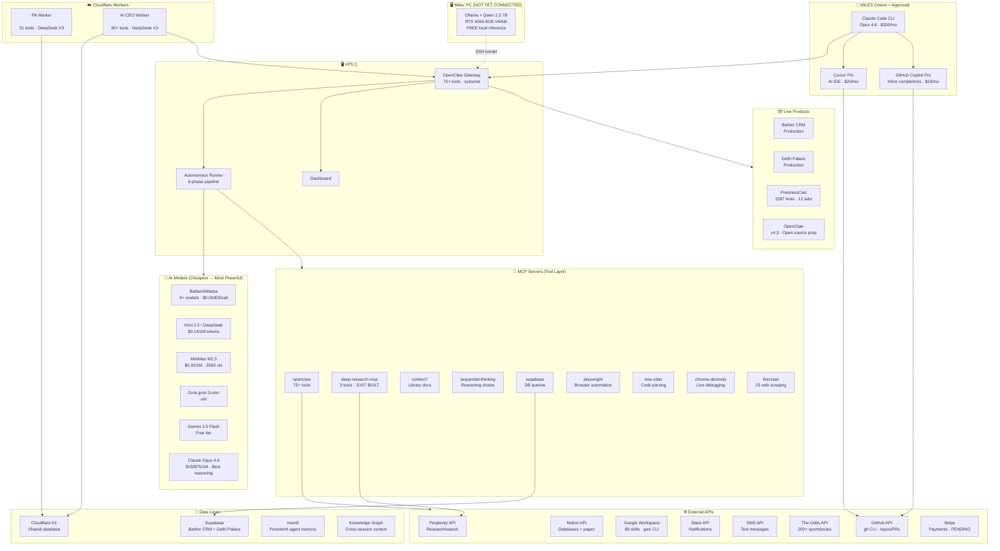
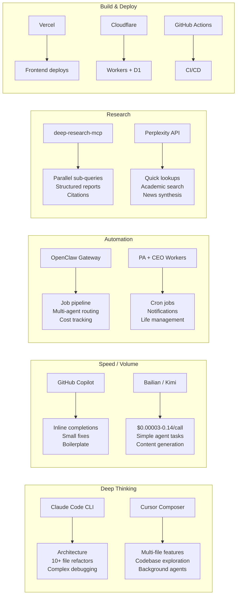
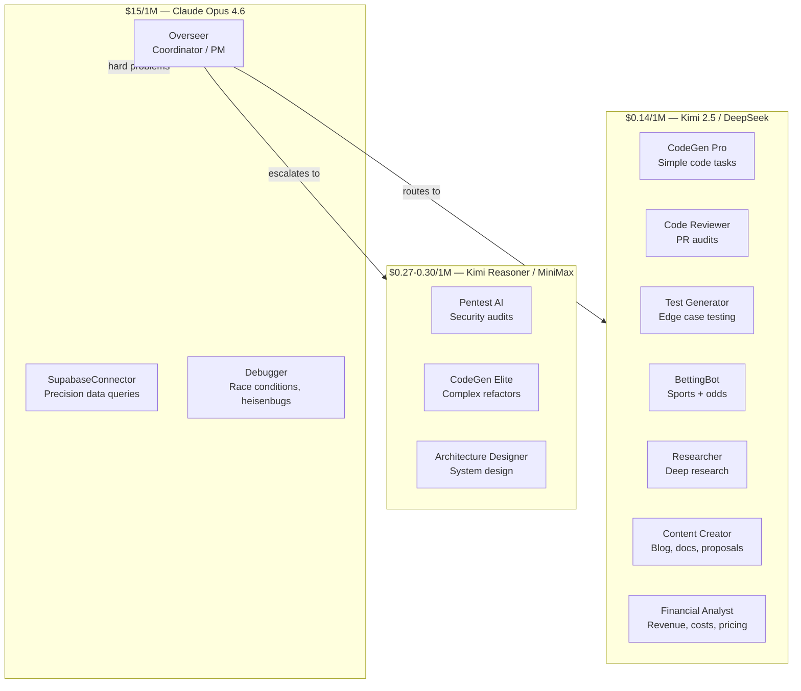
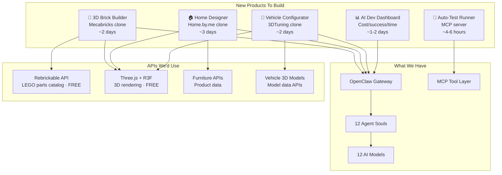

# Miles' Full Stack Map — Everything We Have

> Last updated: 2026-03-07

---

## The Big Picture



---

## What Each Piece Does Best



---

## Cost Map (Monthly)

| Layer | Service | Cost | What You Get |
|-------|---------|------|-------------|
| **Brain** | Claude Max | $200/mo | Opus 4.6, Claude Code, 900 msgs/5hr, headless mode |
| **IDE** | Cursor Pro | $20/mo | Composer, background agents, BugBot, semantic indexing |
| **Completions** | GitHub Copilot Pro | $19/mo | Inline completions, Agent Mode, Actions integration |
| **Cheap Models** | Bailian (Alibaba) | ~$1/mo | 9+ models at $0.00003/call, bundled plan |
| **Cheap Models** | Kimi 2.5 / DeepSeek | ~$2/mo | Agent workhorses, $0.14/1M tokens |
| **Research** | Perplexity API | ~$5/mo | Sonar + Sonar Pro, per-call |
| **Scraping** | Firecrawl | Free tier | 500 pages/month |
| **Infra** | VPS | ~$10/mo | OpenClaw gateway, dashboard |
| **Infra** | Cloudflare | Free | Workers, D1, DNS |
| **Local** | Ollama (PC) | FREE | Not set up yet — infinite free inference |
| | **TOTAL** | **~$257/mo** | |

---

## 12 Agent Souls (Who Does What)



---

## Where New Products Plug In



---

## The Full Pipeline (Ticket → Shipped Product)

```
📥 Input (Notion / GitHub / Slack / SMS)
   │
   ▼
🧠 OpenClaw Gateway (routes to right agent)
   │
   ├── 💰 Tiny task ($0) ──────→ Bailian ($0.00003/call)
   ├── 💰 Small task ($0.001) ─→ Kimi 2.5 ($0.14/1M)
   ├── 💰 Medium task ($0.01) ─→ MiniMax M2.5 ($0.30/1M)
   ├── 💰 Large task ($1-2) ───→ Claude Opus 4.6 ($15/1M)
   └── 💰 Local task (FREE) ──→ Ollama on PC (NOT YET SET UP)
   │
   ▼
🔧 MCP Tools (75+ tools execute the work)
   │
   ├── 🔍 Research ──→ deep-research-mcp → Perplexity
   ├── 🌐 Browse ───→ playwright / firecrawl / chrome-devtools
   ├── 💾 Data ─────→ supabase / D1 / knowledge graph
   ├── 📧 Comms ────→ Slack / SMS / Gmail / Notion
   ├── 🏗️ Code ─────→ file ops / git / GitHub / Vercel
   └── 🎰 Betting ──→ odds API / predictions / arb scanner
   │
   ▼
✅ Output (PR / Deploy / Report / Notification)
```

---

## NOT YET CONNECTED (Opportunities)

| What | Status | Effort | Impact |
|------|--------|--------|--------|
| **Ollama on PC** (RTX 4060) | Instructions saved, not installed | 30 min (Miles) | FREE local inference forever |
| **OpenRouter** | No API key yet | 30 min (sign up + add to .env) | 50 free req/day + cheap DeepSeek |
| **Stripe** | Pending go-live | 1-2 hours | Accept payments for products |
| **Claude Code headless** | Works, no automation scripts | 2-3 hours | Auto PR/review/test pipeline |
| **n8n** (workflow automation) | Not installed | 1 hour | Visual workflow builder, 400+ integrations |
| **npm publish deep-research-mcp** | Built, needs login | 5 min | Public MCP server on npm |

---

## Stack Strengths Summary

**What we're amazing at right now:**
- Multi-agent job pipeline with cost tracking
- 75+ MCP tools for almost anything
- 12 specialized agent souls with routing
- Research (deep-research-mcp + Perplexity)
- Cheap at scale ($0.00003/call with Bailian)
- Full life management (PA worker)

**What we're missing:**
- Frontend products (no customer-facing apps using the AI stack)
- Local model inference (PC not connected yet)
- Payment collection (Stripe pending)
- Public npm packages (deep-research-mcp ready but unpublished)
- Visual workflow builder (n8n not installed)
