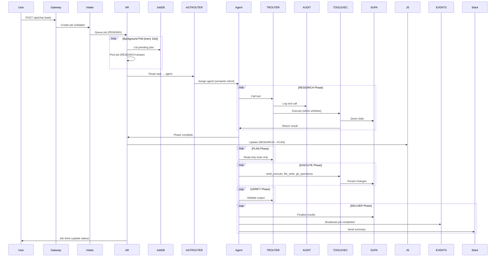

# OpenClaw System Architecture

**Version:** v4.2 (2026-03-07)

**Overview:** OpenClaw is a multi-agent AI agency platform that turns long-running tasks into autonomous job pipelines. Users interact via Telegram/Slack/API, tasks are routed to specialist agents, tools are phase-gated and audited, and results flow through Supabase + event engine for persistence and visibility.

---

## System Topology Diagram

```mermaid
graph TB
    subgraph "User Interfaces"
        TG["Telegram<br/>(Bot)"]
        SL["Slack<br/>(Bot)"]
        API["REST API<br/>(Gateway)"]
        WS["WebSocket<br/>(Real-time)"]
    end

    subgraph "Cloudflare Tunnel Routing"
        CF["Cloudflare Tunnel<br/>(31cb849a...)"]
        D1["<your-domain>:9001"]
        GW["<your-domain>:18789"]
        TGW["telegram<your-domain>:18789"]
    end

    subgraph "Gateway Layer (FastAPI :18789)"
        GAPP["FastAPI App"]
        CORS["CORS Middleware"]
        AUTH["Auth Middleware<br/>(X-Auth-Token)"]
        RATE["Rate Limit<br/>(30 req/min)"]
    end

    subgraph "Router Modules (Modular Design)"
        HEALTH["health.py<br/>(liveness)"]
        CHAT["chat.py<br/>(chat endpoint)"]
        TG_R["telegram.py<br/>(webhook)"]
        SL_R["slack.py<br/>(webhook)"]
        TRADE["trading.py<br/>(arb/prediction)"]
        IR["intelligent_routing.py<br/>(intent → agent)"]
        ADV["advanced.py<br/>(complex tasks)"]
        ADMIN["admin.py<br/>(ops)"]
        EXTRA["extra.py<br/>(reviews/verify)"]
    end

    subgraph "Core Job Pipeline"
        INTAKE["Intake<br/>(validate job)"]
        AR["Autonomous Runner<br/>(poll jobs)"]
        JS["Job Status<br/>(RESEARCH→PLAN→EXEC→VERIFY→DELIVER)"]
        DECOMP["Supervisor<br/>(decompose complex)"]
    end

    subgraph "Agent Routing & Execution"
        AGTROUTER["Agent Router<br/>(semantic intent)"]
        AGTCTX["Agent Context<br/>(memory/templates)"]
        AGTSESS["Agent Sessions<br/>(per-job state)"]
    end

    subgraph "Specialist Agents (Models)"
        OVERSEER["Overseer<br/>(Opus 4.6)"]
        CODEPRO["CodeGen Pro<br/>(Kimi 2.5)"]
        CODEELITE["CodeGen Elite<br/>(MiniMax M2.5)"]
        PENTEST["Pentest AI<br/>(Deepseek)"]
        DB["SupabaseConnector<br/>(Haiku)"]
        RESEARCH["Researcher<br/>(Kimi 2.5)"]
        CONTENT["Content Creator<br/>(Kimi 2.5)"]
        FINANCE["Financial Analyst<br/>(Kimi 2.5)"]
        BETTING["BettingBot<br/>(Kimi 2.5)"]
    end

    subgraph "Model Fallback Chain"
        OC["OpenCode<br/>(Gemini 2.5)"]
        BAIL["Bailian<br/>(9+ models)"]
        GROK["Grok<br/>(grok-3-mini)"]
        MINIMAX["MiniMax<br/>(M2.5)"]
    end

    subgraph "Tool Router & Execution"
        TROUTER["Tool Router<br/>(phase-gated)"]
        PHASE["Phase Tools<br/>(RESEARCH|PLAN|EXEC|VERIFY|DELIVER)"]
        AUDIT["Audit Logging<br/>(tool_calls.jsonl)"]
        TOOLEXEC["Tool Executor<br/>(agent_tools.py)"]
    end

    subgraph "Tool Categories (81 MCP Tools)"
        FILETOOLS["File Tools<br/>(read/write/edit)"]
        CODETOOLS["Code Tools<br/>(git/shell/npm)"]
        WEBTOOLS["Web Tools<br/>(search/fetch/scrape)"]
        DEVTOOLS["Dev Tools<br/>(vercel/docker)"]
        TRADETOOLS["Trading Tools<br/>(Kalshi/Polymarket)"]
        OTHERTOOLS["Other Tools<br/>(Slack/email/memory)"]
    end

    subgraph "Data & State"
        SUPA["Supabase<br/>(RLS + RealTime)"]
        SUPADB["upximucxncuajnakylyf"]
        D1DB["D1 Database<br/>(PA: b0947504)"]
        EVENTS["Event Engine<br/>(closed-loop)"]
        CACHE["Response Cache<br/>(30s TTL)"]
        MEM["Memory Manager<br/>(lancedb)"]
        CP["Checkpoints<br/>(job state)"]
        CRON["Cron Scheduler<br/>(APScheduler)"]
    end

    subgraph "Optional Workers"
        PA["PA Worker<br/>(personal-assistant/)"]
        CEO["CEO Worker<br/>(autonomous crons)"]
        HANDS["Scheduled Hands<br/>(parallel tasks)"]
    end

    subgraph "Observability & Safety"
        METRICS["Metrics<br/>(cost/latency)"]
        LOGS["Logs<br/>(rotating)"]
        GATES["Cost Gates<br/>(per-task limit)"]
        HB["Heartbeat Monitor<br/>(stale job detection)"]
        CIRCUIT["Circuit Breakers<br/>(fail-fast)"]
        ERRRECOV["Error Recovery<br/>(transient retry)"]
    end

    TG --> CF
    SL --> CF
    API --> CF
    WS --> CF

    CF --> GW
    CF --> D1
    CF --> TGW

    GW --> GAPP
    GAPP --> CORS
    CORS --> AUTH
    AUTH --> RATE

    RATE --> HEALTH
    RATE --> CHAT
    RATE --> TG_R
    RATE --> SL_R
    RATE --> TRADE
    RATE --> IR
    RATE --> ADV
    RATE --> ADMIN
    RATE --> EXTRA

    CHAT --> INTAKE
    TG_R --> INTAKE
    SL_R --> INTAKE
    INTAKE --> AR

    AR --> JS
    JS --> DECOMP
    DECOMP --> AGTROUTER

    AGTROUTER --> AGTCTX
    AGTCTX --> AGTSESS

    AGTSESS --> OVERSEER
    AGTSESS --> CODEPRO
    AGTSESS --> CODEELITE
    AGTSESS --> PENTEST
    AGTSESS --> DB
    AGTSESS --> RESEARCH
    AGTSESS --> CONTENT
    AGTSESS --> FINANCE
    AGTSESS --> BETTING

    OVERSEER --> OC
    CODEPRO --> BAIL
    CODEELITE --> GROK
    PENTEST --> MINIMAX

    OVERSEER --> TROUTER
    CODEPRO --> TROUTER
    CODEELITE --> TROUTER
    PENTEST --> TROUTER
    DB --> TROUTER
    RESEARCH --> TROUTER
    CONTENT --> TROUTER
    FINANCE --> TROUTER
    BETTING --> TROUTER

    TROUTER --> PHASE
    PHASE --> AUDIT
    AUDIT --> TOOLEXEC

    TOOLEXEC --> FILETOOLS
    TOOLEXEC --> CODETOOLS
    TOOLEXEC --> WEBTOOLS
    TOOLEXEC --> DEVTOOLS
    TOOLEXEC --> TRADETOOLS
    TOOLEXEC --> OTHERTOOLS

    TOOLEXEC --> SUPA
    TOOLEXEC --> D1DB

    SUPA --> SUPADB
    AR --> EVENTS
    JS --> CACHE
    AR --> MEM
    AR --> CP
    AR --> CRON

    AR --> METRICS
    AR --> LOGS
    AR --> GATES
    AR --> HB
    AR --> CIRCUIT
    AR --> ERRRECOV

    PA -.-> SUPA
    CEO -.-> SUPA
    HANDS -.-> AR

    style GAPP fill:#4a90e2
    style AR fill:#7ed321
    style TROUTER fill:#f5a623
    style OVERSEER fill:#bd10e0
    style CODEPRO fill:#50e3c2
    style CODEELITE fill:#9013fe
    style PENTEST fill:#d0021b
```



---

## Data Flow: Job Lifecycle



---

## Component Details

### Gateway (FastAPI :18789)

**Location:** `./gateway.py`

**Responsibilities:**
- Startup/shutdown lifecycle management (lifespan context manager)
- Route registration (all routers mounted here)
- Middleware: CORS, Auth (X-Auth-Token), Rate limiting (30 req/min per IP)
- Static file serving (`/static`)
- Exempt paths for webhooks and public endpoints

**Key Routers:**
- `health.py` — liveness checks, metrics endpoint
- `chat.py` — main chat endpoint, message processing
- `telegram.py` — Telegram webhook handler
- `slack.py` — Slack event subscriptions
- `intelligent_routing.py` — semantic intent routing
- `trading.py` — prediction market / sports betting API
- `advanced.py` — complex task handling
- `extra.py` — review cycles, output verification

### Autonomous Runner (Background Job Executor)

**Location:** `./autonomous_runner.py`

**Responsibilities:**
- Background asyncio loop that polls for pending jobs every 10s
- 5-phase pipeline: RESEARCH → PLAN → EXECUTE → VERIFY → DELIVER
- Tool execution with phase-gating (different tools available per phase)
- Cost tracking per job/phase
- Checkpoint & recovery on failure
- Parallel execution (configurable max_concurrent, default 3)

**Key Features:**
- Error classification (network, auth, not_found, resource, constraint, logic)
- Reflexion engine (learns from failures via saved_reflection)
- Supervisor decomposition (splits complex jobs into sub-jobs)
- Memory injection (contextual knowledge from prior sessions)

### Agent Router (Intelligent Delegation)

**Location:** `./agent_router.py`

**Responsibilities:**
- Semantic analysis of user query (intent extraction)
- Route to best agent based on cost + capability
- Caching routing decisions (5 min TTL)
- Fallback to keyword matching if embeddings fail

**Agents & Models:**
- **Overseer** (project_manager) → Claude Opus 4.6 ($15/M tokens) — coordination
- **CodeGen Pro** (coder_agent) → Kimi 2.5 ($0.14/M tokens) — simple code
- **CodeGen Elite** (elite_coder) → MiniMax M2.5 ($0.30/M tokens) — complex code
- **Pentest AI** (hacker_agent) → Deepseek ($0.27/M tokens) — security
- **SupabaseConnector** (database_agent) → Haiku ($0.50/M tokens) — SQL
- **Researcher** → Kimi 2.5 ($0.14/M tokens) — research
- **Content Creator** → Kimi 2.5 ($0.14/M tokens) — writing
- **Financial Analyst** → Kimi 2.5 ($0.14/M tokens) — finance
- **BettingBot** → Kimi 2.5 ($0.14/M tokens) — sports/trading

### Tool Router (Phase-Gated Execution)

**Location:** `./tool_router.py`

**Responsibilities:**
- Phase-to-tool mapping enforcement
- Agent tool allowlist checking
- Audit logging (tool_calls.jsonl)
- Tool risk classification (safe/medium/high)

**Phase Tools:**
- **RESEARCH** — web_search, web_fetch, web_scrape, file_read, grep_search, github_repo_info
- **PLAN** — file_read, glob_files, grep_search (read-only)
- **EXECUTE** — shell_execute, git_operations, file_write, file_edit, install_package, vercel_deploy
- **VERIFY** — shell_execute, file_read, github_repo_info
- **DELIVER** — git_operations, vercel_deploy, send_slack_message

**Tool Categories:**
1. **File Tools** — file_read, file_write, file_edit, glob_files, grep_search
2. **Code Tools** — shell_execute, git_operations, install_package, env_manage
3. **Web Tools** — web_search, web_fetch, web_scrape, research_task
4. **Dev Tools** — vercel_deploy, process_manage, docker tools
5. **Trading Tools** — kalshi_trade, polymarket_trade, sportsbook_odds, prediction markets
6. **Communication Tools** — send_slack_message, telegram, email
7. **Data Tools** — supabase queries, memory operations, event engine
8. **Compute Tools** — math, stats, sorting, hashing, matrix operations

### Data Layer

**Supabase (Main DB):**
- URL: `https://upximucxncuajnakylyf.supabase.co`
- Anon Key (read-only): public access
- Service Role Key (write): server-side access
- Tables: jobs, runs, audit_logs, reflections, memories
- Features: RLS (Row-Level Security), RealTime subscriptions

**D1 Database (Cloudflare, PA Worker):**
- DB ID: b0947504
- Purpose: PA worker's dedicated data store (life management, briefings, reminders)
- Separate from CEO worker (uses personal-assistant DB)

**Local State:**
- `data/jobs/runs/{job_id}/` — job logs, checkpoints, tool output
- `data/audit/tool_calls.jsonl` — audit trail
- `data/reflections/` — learned lessons
- `data/memories/` — agent knowledge base

### Memory & Persistence Systems

**Memory Manager** (lancedb-based):
- Contextual knowledge retrieval for agents
- Semantic search over past interactions
- Auto-extraction of learnings post-job

**Event Engine**:
- Closed-loop system (job completion → reaction rules → action)
- Broadcasts: job.created, job.completed, job.failed, cost.alert
- Enables automation (auto-escalations, notifications)

**Checkpoint System**:
- Saves job state at end of each phase
- Allows resumption after crashes
- Clears on job completion

**Reflexion Engine**:
- Saves post-job learnings
- Format: {agent, task, outcome, error, insight}
- Used in next agent context for learning

### Cost & Safety Systems

**Cost Tracker**:
- Per-agent token usage (input/output)
- Per-phase cost calculation
- Job-level budget caps ($15/job default)
- Daily/monthly spend tracking

**Cost Gates** (Guardrails):
- Per-task limit (hard cap)
- Daily budget (rollover, no overage)
- Monthly budget (alert at 80%)
- Escalation for high-cost tasks

**Heartbeat Monitor**:
- Detects stale/hung jobs (no progress 5 min)
- Timeout threshold (1 hour)
- Alerts on staleness

**Error Recovery**:
- Transient error retry (network, rate-limit, timeout)
- Permanent error escalation (auth, not_found, constraint)
- Circuit breakers (fail-fast on repeated failures)

---

## External Integrations

### Cloudflare Tunnel (Reverse Proxy)

**Config:** `/root/.cloudflared/config.yml`

**Routing:**
- `<your-domain>` → http://localhost:9001 (dashboard)
- `<your-domain>` → http://localhost:18789 (API)
- `telegram<your-domain>` → http://localhost:18789 (Telegram webhook)
- `<your-domain>` → http://localhost:18789 (fallback)
- `openclaw.coderemote.dev` → http://localhost:18789 (legacy)

### Messaging Platforms

**Telegram:**
- Bot Token: env var `TELEGRAM_BOT_TOKEN`
- Webhook: `/telegram/webhook`
- User ID: `TELEGRAM_USER_ID`
- Alerts sent to Telegram on task completion/failure

**Slack:**
- Bot Token: `SLACK_BOT_TOKEN`
- App Token: `SLACK_APP_TOKEN`
- Report Channel: `SLACK_REPORT_CHANNEL`
- Commands: `/openclaw`, `/status`, etc.

**Discord:**
- Optional integration (env var `DISCORD_BOT_TOKEN`)

### AI Model APIs

**Primary Models:**
- **Anthropic (Claude)** — Opus 4.6, Sonnet, Haiku
- **Deepseek (Kimi)** — Kimi 2.5 for CodeGen Pro
- **MiniMax** — M2.5 for CodeGen Elite
- **Gemini** — 2.5 Flash for fallback
- **OpenAI** — GPT-4o (optional)
- **Grok** — grok-3-mini for fallback chain

**Fallback Chain (per model):**
1. Primary agent's model
2. OpenCode (Gemini 2.5 Flash)
3. Bailian (Alibaba DashScope, 9+ models)
4. Grok (grok-3-mini)
5. MiniMax (M2.5)
6. Anthropic (Opus 4.6, most reliable but expensive)

### Trading & Prediction APIs

**Kalshi (Binary Options):**
- Auth: API Key + Private Key (`./data/trading/kalshi_private.pem`)
- Markets: stocks, crypto, economic events
- Tools: buy, sell, cancel orders, portfolio queries

**Polymarket (Crypto Prediction):**
- Markets: events, politics, crypto, sports
- Tools: query prices, check book, arb scanning
- Proxy: routes through Cloudflare to bypass US geoblock

**The Odds API (Sports Betting):**
- Live odds from 200+ sportsbooks
- Markets: moneyline, spreads, totals
- Tools: `sportsbook_odds`, `sportsbook_arb`

### External Services

**Supabase (Auth, DB, RealTime):**
- Project: upximucxncuajnakylyf
- Used for: jobs, audit, reflections, RLS enforcement

**Vercel (Deployment):**
- Used by CodeGen Elite for deploying web projects
- Auth: `VERCEL_API_TOKEN`

**GitHub (VCS Integration):**
- Webhooks for CI/CD
- Repo info, issue creation
- Auth: GitHub token from .env

**Perplexity (Research API):**
- Research agent fallback for synthesis
- Env: `PERPLEXITY_API_KEY`

**ElevenLabs (Voice):**
- TTS for voice replies in Slack/Discord
- Env: `ELEVENLABS_API_KEY`

---

## Deployment & Operations

### Local Development

```bash
cd ./
python3 -m venv venv
source venv/bin/activate
pip install -r requirements.txt

# Start gateway
python3 gateway.py

# Or with systemd
systemctl restart openclaw-gateway
systemctl status openclaw-gateway
journalctl -u openclaw-gateway -f
```

### Production (VPS <your-vps-ip>)

**Systemd Service:**
- Service: `openclaw-gateway`
- Config: `/etc/systemd/system/openclaw-gateway.service`
- Loads env from: `EnvironmentFile=./.env`
- Auto-restart: on crash

**Cloudflare Tunnel:**
- Daemon: `cloudflared`
- Config: `/root/.cloudflared/config.yml`
- Status: `systemctl status cloudflared`

**Dashboard:**
- Separate service on port 9001
- URL: `<your-domain>`

### Optional Workers

**PA Worker** (`./workers/pa/`):
- Dedicated D1 database (b0947504)
- Owns life management tools (calendar, email, reminders)
- Deployed separately with own cron jobs

**CEO Worker** (`./workers/personal-assistant/`):
- Autonomous loops (prediction markets, shift detection)
- Owns strategic crons (not life management)
- Same Supabase as gateway

---

## Cost Model

**Per-Token Pricing:**
- Opus 4.6: $15/M input, $75/M output
- MiniMax M2.5: $0.30/M input, $1.20/M output
- Kimi 2.5: $0.14/M input, $0.28/M output
- Deepseek: $0.27/M reasoning, $0.68/M output
- Haiku: $0.50/M input, $1.50/M output

**Example Job Cost:**
- Research (Kimi): 5000 tokens × $0.14 = $0.70
- Plan (Kimi): 8000 tokens × $0.14 = $1.12
- Execute (Kimi): 3000 tokens × $0.14 = $0.42
- **Total: ~$2.24 per simple job**

**Budget Limits:**
- Per-job: $15 (hard cap, prevents runaway costs)
- Daily: $100 (soft alert at 80%)
- Monthly: $3000 (alert at 80%)

---

## Security Model

### Authentication

1. **API Requests:** X-Auth-Token header (SHA256 hash)
2. **Telegram:** Token validation + owner ID check
3. **Slack:** Signing secret validation (HMAC)
4. **Supabase RLS:** Row-level security policies per user

### Authorization

- **Agent Allowlists** (agent_tool_profiles.py): Per-agent tool access control
- **Phase Gating** (tool_router.py): Tools blocked in read-only phases
- **Audit Logging** (tool_calls.jsonl): Every tool invocation logged with agent, phase, input, output

### Data Protection

- **RLS Policies:** Supabase enforces user-level data isolation
- **No Hardcoded Secrets:** All keys in .env, never in source
- **Encrypted Transports:** HTTPS everywhere (Cloudflare tunnel)
- **Audit Trail:** Immutable job logs in data/jobs/runs/

---

## Testing & Validation

**Test Suites:**
- Unit tests: 170+ tests (pipeline package, routers, agent_tools)
- Integration tests: job pipeline end-to-end
- Phase validation: output_verifier.py
- Phase scoring: phase_scoring.py

**Validation Hooks:**
- Input validation at gateway (job_manager.py)
- Output validation per phase (validate_phase_output)
- Review cycle engine (extra.py)

---

## Roadmap & Known Limitations

### v4.2 Status
- **Complete:** Multi-agent routing, phase-gated tools, autonomous runner, cost gating, error recovery, event engine
- **In Progress:** Dashboard analytics, streaming responses, caching layer
- **TODO:** Self-improving agent templates, dynamic tool creation, advanced PRM scoring

### Known Issues
- Oz cloud agents DISABLED (burned 900 credits/night, use_oz=False)
- PA + CEO databases separated (no longer shared)
- Fallback chain needs profiling (which model to pick first)

### Future Work
- Caching layer for tool results (5 min TTL)
- Streaming job output to WebSocket
- Agent performance dashboards (cost per task type)
- Dynamic tool creation (agents generate new tools)
