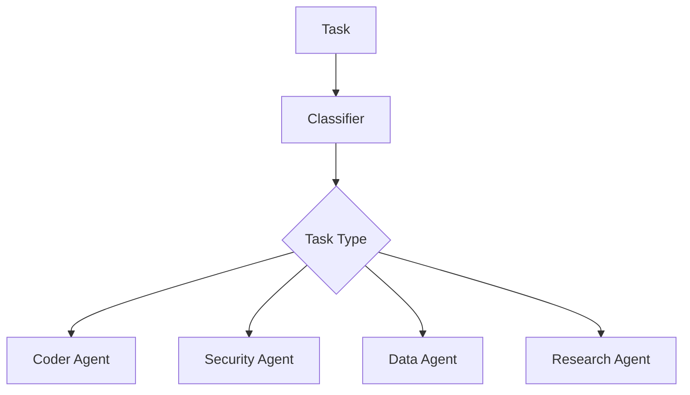

# Agent Routing

OpenClaw routes requests to specialized agents based on task type, complexity, and risk.

## Routing Inputs

- Task description and user intent
- Required tool classes
- Risk and safety sensitivity
- Expected cost and latency

## Relevant Modules

- `routers/intelligent_routing.py`
- `autonomous_runner.py`
- `routing/agent-graph.py` (TypeScript gateway side)
