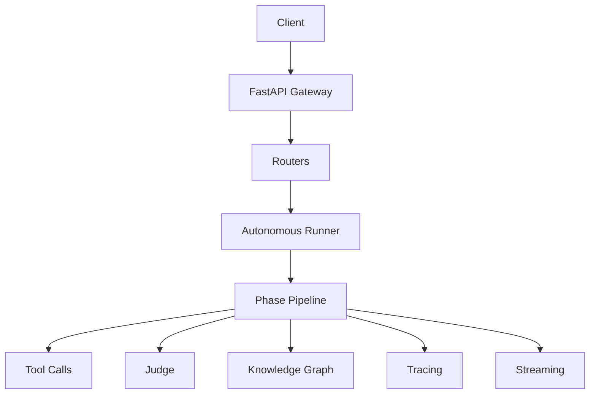

# Architecture Overview

OpenClaw is a FastAPI-based orchestration gateway with modular routers, a multi-phase execution pipeline, real-time stream events, tracing, and quality evaluation.

## Main Components

- Gateway shell: `gateway.py`
- Routers: `routers/*.py`
- Event engine: `event_engine.py`
- Streaming: `streaming.py`
- Tracing: `otel_tracer.py`
- Quality judge: `llm_judge.py`
- Knowledge graph: `kg_engine.py`
