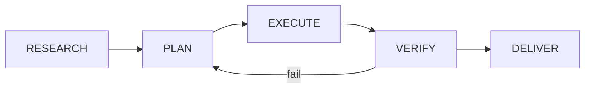

# Pipeline Phases

Each job runs through a deterministic five-phase lifecycle.

## Phase Model

| Phase | Objective | Typical Output |
|---|---|---|
| `RESEARCH` | Gather context and constraints | findings summary |
| `PLAN` | Build execution plan | step list + acceptance checks |
| `EXECUTE` | Run tools and produce artifact | code/content/result |
| `VERIFY` | Validate behavior | tests/checks/analysis |
| `DELIVER` | Return final output and metadata | final response + cost |

## Controls

- Cost and quota checks: `cost_gates.py`
- Event instrumentation: `event_engine.py`
- Optional retry/self-repair loops in verification phase
