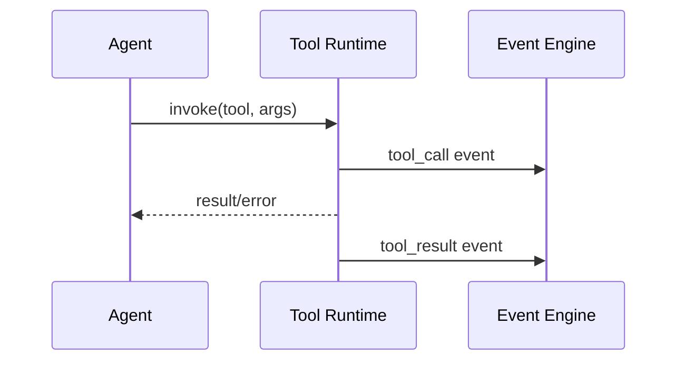

# Tool System

OpenClaw executes tasks through controlled tool invocation surfaces.

## Tool Lifecycle

1. Select tool candidate set
2. Validate arguments
3. Execute with timeout and event logging
4. Capture result and errors
5. Feed result to next phase

## Safety Controls

- Per-phase restrictions
- Timeouts and retries
- Cost tracking per execution step
- Audit trail in events logs
