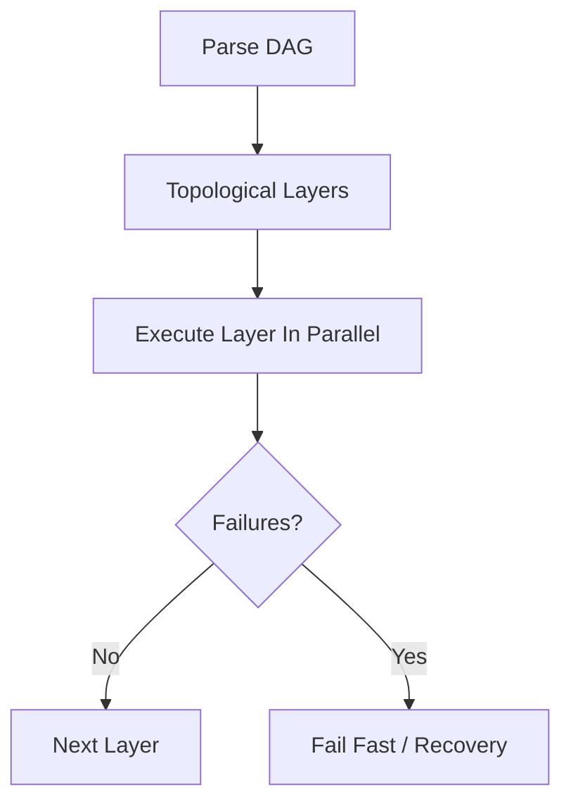

# DAG Parallel Execution

OpenClaw supports dependency-aware parallel execution for workflows represented as Directed Acyclic Graphs.

## Data Flow



## API Reference

| Endpoint | Method | Purpose |
|---|---|---|
| `/workflows` | GET/POST | workflow list/create |
| `/workflows/{workflow_id}/start` | POST | execute workflow |
| `/workflow/status/{workflow_id}` | GET | execution state |

## Python Client

```python
import requests

wf = requests.post("http://localhost:18789/workflows", json={"name": "build-and-test", "nodes": [], "edges": []}).json()
requests.post(f"http://localhost:18789/workflows/{wf['id']}/start")
print(requests.get(f"http://localhost:18789/workflow/status/{wf['id']}").json())
```

## Architecture Notes

- Layered execution strategy based on Kahn-style topological ordering
- Fail-fast option for dependency graph integrity
- Supports deterministic replay when event logs are preserved
