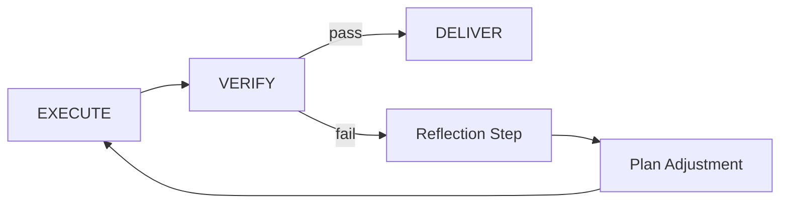

# Reflexion and Self-Repair

OpenClaw can re-plan and retry when verification fails, reducing brittle one-shot failures.

## Data Flow



## API Reference

| Endpoint | Method | Purpose |
|---|---|---|
| `/api/reflections` | GET | reflection history |
| `/api/reflections/stats` | GET | reflection aggregate stats |
| `/api/reflections/search` | POST | reflection lookup |

## Python Client

```python
import requests

stats = requests.get("http://localhost:18789/api/reflections/stats").json()
print(stats)
```

## Architecture Notes

- Reflection artifacts capture failure cause and remedial plan
- Re-entry point is usually PLAN or EXECUTE based on failure type
- Integrates with event log for observability
