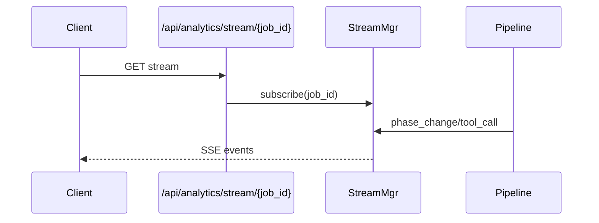

# Real-Time Streaming

OpenClaw streams job progress over Server-Sent Events (SSE) so clients can display live pipeline activity.

## Data Flow



## API Reference

| Endpoint | Method | Purpose |
|---|---|---|
| `/api/analytics/stream/{job_id}` | GET | stream live events |

## Python Client

```python
import httpx

with httpx.stream("GET", "http://localhost:18789/api/analytics/stream/job-123") as r:
    for line in r.iter_lines():
        if line.startswith("data:"):
            print(line[5:])
```

## Architecture Notes

- In-memory stream manager with per-job subscriptions
- Event bridge from phase execution and tool handlers
- Heartbeat headers set for reverse-proxy compatibility
