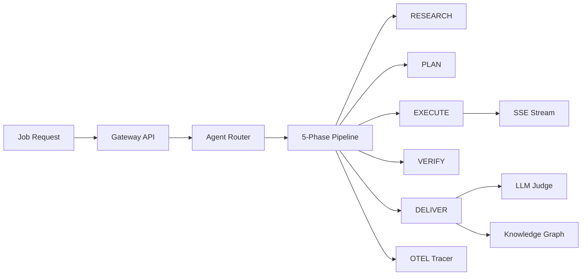

# OpenClaw

**Autonomous AI agent orchestration that combines the best of Devin, Cursor, Windsurf, and Manus, open source and self-hosted.**

<div class="grid cards" markdown>

- **Multi-Agent Routing**

    ---

    12+ specialized agents. Each task is routed to the cheapest capable agent without compromising quality.

- **Phase-Gated Pipeline**

    ---

    Every job flows through `RESEARCH -> PLAN -> EXECUTE -> VERIFY -> DELIVER` with phase-level controls.

- **LLM-as-Judge Evaluation**

    ---

    Completed jobs are scored on correctness, completeness, and safety with rubric-weighted quality checks.

- **Knowledge Graph Learning**

    ---

    Tool-chain outcomes are stored in SQLite and used to recommend higher-success execution paths.

- **Real-Time Streaming**

    ---

    Stream phase transitions, tool calls, and completion events over SSE as jobs run.

- **OpenTelemetry Tracing**

    ---

    Span-level traces for every job with parent-child structure and timing diagnostics.

</div>

## Quick Start

```bash
pip install openclaw
export OPENCLAW_MODEL_PROVIDER=anthropic
export ANTHROPIC_API_KEY=sk-ant-...
openclaw serve --port 8000
```

Submit a job:

```bash
curl -X POST http://localhost:8000/api/jobs \
  -H "Content-Type: application/json" \
  -d '{"task":"Fix login validation edge cases","department":"engineering"}'
```

## How It Compares

| Feature | OpenClaw | Devin | Cursor | Windsurf |
|---|---|---|---|---|
| Multi-agent routing | Yes | No | No | No |
| Phase-gated execution | Yes | Partial | No | No |
| LLM-as-Judge | Yes | No | No | No |
| Knowledge graph | Yes | No | No | No |
| Real-time streaming | Yes | Yes | No | Partial |
| OTEL tracing | Yes | No | No | No |
| Self-hosted | Yes | No | No | No |
| Open source | Yes | No | No | No |

## Architecture



## Reliability Baseline

- Pipeline instrumentation in `event_engine.py`, `streaming.py`, and `otel_tracer.py`
- Knowledge graph in `kg_engine.py`
- Judge system in `llm_judge.py`
- DAG execution in `dag_executor.py`

